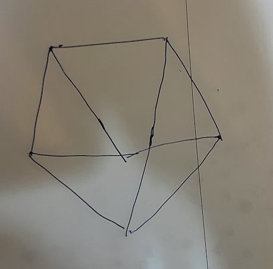
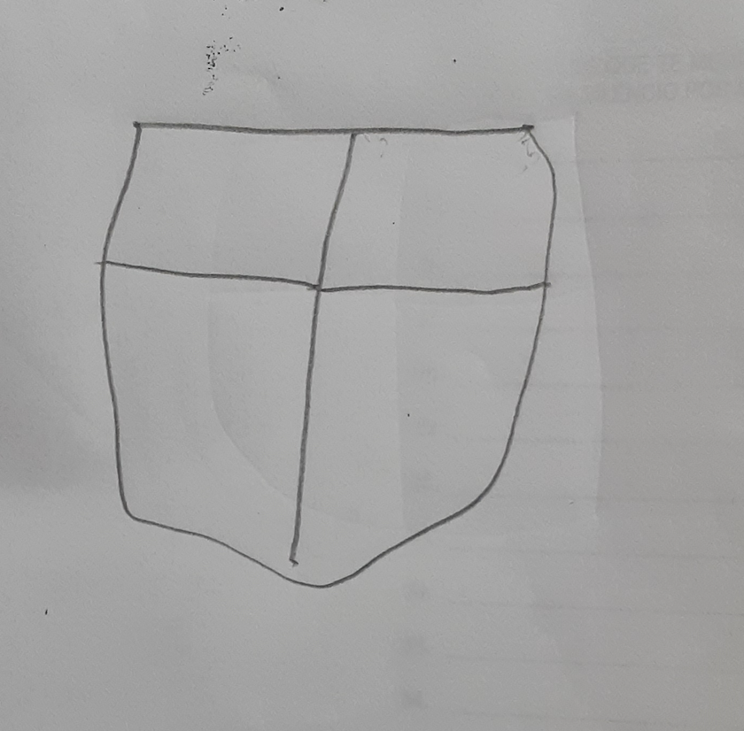
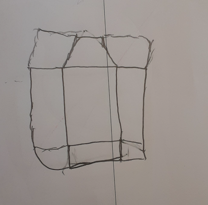

# CubeScore

Multi-label classifier for CERAD cube drawings. Part of the PraxisNet model family.

**Current Release:** v1.0

## What This Does

Classifies cube drawings along multiple dimensions (TBD based on CERAD scoring criteria).

**Architecture:** Single model (~330 MB) with classification heads sharing a DINOv2 ViT-B/14 backbone.

## CERAD Cube Scoring Criteria

The cube is worth 4 points, with 1 point awarded for each criterion. The total cube score is the sum of the four criteria (range: 0-4 points).

| Criterion | Points | Description |
|-----------|--------|-------------|
| Three-dimensional figure | 1 | Shows depth/volume, not flat |
| Frontal face correct | 1 | Recognizable square/rectangular front face |
| Internal lines correct | 1 | Three connecting lines creating depth |
| Opposite sides parallel | 1 | Parallel edges within 10° tolerance |

### Criterion 1: Three-Dimensional Figure (1 point)

The drawing must demonstrate three-dimensionality—depicting depth and volume rather than a flat, two-dimensional shape.

**Requirements:**
- Clear evidence of perspective or depth cues
- At least one vertex where three edges meet at angles suggesting depth (approximately 90° between edge pairs)

**Fails criterion:** Flat hexagons, overlapping squares without depth cues, or shapes lacking volume.

**Why it matters:** Representing 3D space on a 2D surface requires intact visuospatial processing and mental rotation abilities, commonly impaired in dementia.

### Criterion 2: Frontal Face Correct (1 point)

The cube must have a recognizable square or rectangular front face.

**Requirements:**
- A clear front-facing square/rectangle with approximately parallel opposite sides
- Not severely distorted into a trapezoid or diamond shape

**Fails criterion:** No identifiable front face, or front face too distorted to appear square/rectangular.

### Criterion 3: Internal Lines Correct (1 point)

The cube must have the correct internal lines—the edges connecting front and back faces that create depth perception.

**Requirements:**
- Three internal lines connecting corresponding vertices of front and back faces
- All three must be present (missing any fails the criterion)
- Lines drawn with appropriate direction and placement
- No extra lines where they don't belong

**Technical note:** A cube has 12 edges, but in a wire-frame drawing only 3 internal connecting lines are visible. These transform two overlapping squares into a 3D cube.

**Fails criterion:** Missing internal lines, incorrectly placed lines, extra diagonal lines, or lines that don't connect corresponding vertices.

### Criterion 4: Opposite Sides Parallel (1 point)

Opposite edges must be drawn as parallel or near-parallel lines (within 10° tolerance).

**Requirements:**
- Three pairs of opposite edges to evaluate: top/bottom, left/right, front/back depth edges
- Each pair approximately parallel (within 10° angular deviation)
- Rectangular prisms accepted—edges need not be equal length, just parallel

**What "opposite sides" means:** For a cube, evaluators assess whether:
- Top and bottom edges are parallel
- Left and right edges are parallel
- Front and back depth edges are parallel

The third pair (front/back depth edges) cannot exist in a 2D drawing because depth edges are what create three-dimensionality. This criterion is therefore only applicable when a 3D attempt is present (criterion 1 passes).

**Why 10° tolerance:** Accounts for normal hand-drawing variability and minor tremor. The criterion detects significant visuospatial impairment without penalizing minor motor control issues.

**Fails criterion:** Opposite edges visibly converging or diverging beyond 10°.

## Scoring Non-3D Attempts

**Scholarly precedent:** The [CERAD Neuropsychological Manual](https://www.scribd.com/document/911838779/CERAD-neuropsychological-manual) provides the foundational scoring criteria but leaves some ambiguities. We supplement with established cube scoring methods ([Maeshima et al., 1997](https://pubmed.ncbi.nlm.nih.gov/9354492/); Shimada et al.) which classify flat/2D drawings as failed attempts that receive no points. The Shimada pattern classification explicitly categorizes drawings into "two-dimensional" (Patterns 0-2) versus "three-dimensional" (Patterns 3-7), with 2D attempts not scored on cube-specific criteria like points of connection (POC) or plane-drawing errors (PDE). Similarly, simpler scoring methods like the Addenbrooke's 0-2 scale require "a general cube shape" be maintained for any points ([Charernboon, 2017](https://pmc.ncbi.nlm.nih.gov/articles/PMC5307133/)). See [Mori et al., 2021](https://pmc.ncbi.nlm.nih.gov/articles/PMC8080165/) for a comparative analysis of these methods.

**Alternative approach:** [Jiang et al., 2024](https://arxiv.org/abs/2512.01367) propose a 4-level scoring system (0-3) that awards 1 point for flat 2D drawings (e.g., unconnected rectangles) to address the limitation that elderly participants with less formal education often lack exposure to 3D geometry concepts. Under strict binary scoring, these individuals would receive zero points, potentially undermining assessment validity.

**Conclusion:** Different researchers have handled this ambiguity in different ways. This model provides users with a choice by scoring individual features regardless of cube presence, then allowing researchers to ground their analysis on the `cube` column. Users can adopt strict scoring (no cube = all criteria score 0) or feature-based analysis (evaluate what structural elements were captured in any attempt).

**Model training approach:** For the purposes of training this image recognition model, we score individual features (front face, parallel sides) on all drawing attempts, regardless of whether a 3D cube is present. This provides more training signal for the model to learn feature recognition.

**Researcher flexibility:** When using model outputs, researchers may choose how to handle this:
1. **Traditional scoring:** Use the `cube` column—if `no_cube`, set all other criteria to 0
2. **Feature-based analysis:** Treat each criterion independently to analyze which specific features participants captured, even in failed attempts

This flexibility allows the model to serve both traditional CERAD scoring workflows and more granular visuospatial research.

## Example Scoring

### Example 1: 3D Attempt Without Cube Structure



This drawing shows a 3D attempt (converging lines creating depth) but does not form a proper cube structure—it resembles a pyramid or tent shape.

| Criterion | Score | Reasoning |
|-----------|-------|-----------|
| cube | yes | There is a 3D drawing attempt (not `no_cube` or `no_drawing`) |
| three_dimensions | yes | Clear depth perception with converging lines |
| front_correct | no | Base is a pentagon, not a square/rectangle |
| connecting_lines_3d | no | Lines converge to a point rather than connecting two parallel faces |
| parallel_sides | no | Lines converge instead of staying parallel |

**Total CERAD-style score:** 1/4 (only three-dimensional criterion passes)

This example illustrates how a participant may demonstrate visuospatial depth perception while failing to capture the specific structural properties of a cube.

### Example 2: Cube Attempt with 0 Points



This drawing is an attempt at the cube task but fails all structural criteria—it's flat with curved/irregular edges and no recognizable cube features.

| Criterion | Score | Reasoning |
|-----------|-------|-----------|
| cube | yes | There is a drawing attempt |
| three_dimensions | no | Flat shape, no depth cues |
| front_correct | no | Curved/irregular outline, not a square/rectangle |
| connecting_lines_3d | no | Internal lines don't connect parallel faces |
| parallel_sides | no | Edges are curved, not parallel |

**Total CERAD-style score:** 0/4

This contrasts with Example 1: both are cube attempts (`cube = yes`), but Example 1 scores 1/4 (captured 3D depth) while this scores 0/4 (no structural properties captured).

### Example 2b: Another 0-Point Attempt


Another example of a cube attempt that fails all structural criteria.

| Criterion | Score | Reasoning |
|-----------|-------|-----------|
| cube | yes | There is a drawing attempt |
| three_dimensions | no | No depth cues |
| front_correct | no | No recognizable square/rectangular front face |
| connecting_lines_3d | no | No proper connecting lines |
| parallel_sides | no | No parallel edges |

**Total CERAD-style score:** 0/4

### Example 3: Front Face Only (No 3D)



This drawing has a recognizable rectangular front face but lacks three-dimensionality—the internal lines divide the shape into sections rather than creating depth.

| Criterion | Score | Reasoning |
|-----------|-------|-----------|
| cube | yes | There is a drawing attempt |
| three_dimensions | no | Flat shape with grid-like divisions, no depth cues |
| front_correct | yes | Roughly rectangular front face |
| connecting_lines_3d | no | Internal lines subdivide the plane, don't connect front/back faces |
| parallel_sides | no | Edges are wobbly/curved |

**Total CERAD-style score:** 1/4 (front face only)

This is an edge case illustrating that a drawing can have a correct front face without demonstrating 3D understanding. Compare with Example 1 which scores 1/4 for 3D (depth perception) but fails front face—different visuospatial skills captured.

### Example 4: Perfect Cube (4/4)


This drawing demonstrates all four criteria for a complete cube.

| Criterion | Score | Reasoning |
|-----------|-------|-----------|
| cube | yes | Clear cube attempt |
| three_dimensions | yes | Clear 3D structure with depth |
| front_correct | yes | Recognizable rectangular front face |
| connecting_lines_3d | yes | Three internal lines connecting front to back faces |
| parallel_sides | yes | Opposite edges are parallel within tolerance |

**Total CERAD-style score:** 4/4

## v1.0 Performance

**Dataset:**
- Training set: 120 images
- Test set: 30 images (held out, stratified by cube presence)

**Test Set Metrics:**

| Dimension | Accuracy | Correct/Total |
|-----------|----------|---------------|
| drawing_presence | 96.7% | 29/30 |
| cube | 90.0% | 27/30 |
| three_dimensions | 86.7% | 26/30 |
| front_correct | 66.7% | 20/30 |
| connecting_lines_3d | 76.7% | 23/30 |
| paralell_sides | 80.0% | 24/30 |
| **Average** | **82.8%** | |

**Analysis:**
- **Strong:** Drawing presence (96.7%) and cube detection (90.0%) perform well
- **Good:** Three dimensions (86.7%) and parallel sides (80.0%) are reliable
- **Weaker:** Front correct (66.7%) and connecting lines (76.7%) have room for improvement—these criteria involve more subjective edge cases

**Next Steps:**
1. Add more training examples, especially for edge cases (partial cubes, ambiguous front faces)
2. Consider adjusting labeling criteria for front_correct to reduce ambiguity
3. Evaluate inter-rater reliability on difficult cases

## Classification Dimensions

| Dimension | Categories | Question |
|-----------|------------|----------|
| **drawing_presence** | `drawing`, `no_drawing` | Is there any drawing on the page? |
| **cube** | `yes`, `no` | Is there a cube attempt? |
| **three_dimensions** | `yes`, `no` | Does it show 3D depth? |
| **front_correct** | `yes`, `no` | Is the front face a recognizable square/rectangle? |
| **connecting_lines_3d** | `yes`, `no` | Are there 3 internal lines connecting front/back faces? |
| **parallel_sides** | `yes`, `no` | Are opposite edges parallel within 10°? |

### Defining "Cube Present" vs "No Cube"

**This is a judgment call:** For this model, `cube=yes` requires some attempt or understanding of 3D shape to be present—even if the cube is poorly drawn. If the drawing demonstrates an understanding of three-dimensionality (depth, perspective, converging lines suggesting volume), it is classified as `cube=yes`.

**`cube=yes`** (cube attempt present):
- Any drawing that attempts to represent a 3D form
- Includes poorly executed cubes that still show 3D understanding
- Includes non-cube 3D shapes (pyramids, prisms) that demonstrate depth perception

**`cube=no`** (no cube attempt):
- Flat 2D shapes with internal lines but no depth attempt (e.g., a square with diagonal lines subdividing it)
- Shapes that lack any indication of three-dimensionality
- Random scribbles or unrelated drawings

**Rationale:** The distinction matters because a participant who attempts a 3D representation—even unsuccessfully—is demonstrating different cognitive processing than one who draws a flat shape. This boundary allows the model to distinguish between "tried and failed at 3D" versus "did not attempt 3D at all."

**Note:** Once `cube=yes` is established, the individual criteria (three_dimensions, front_correct, etc.) determine the CERAD score (0-4 points). A drawing can be `cube=yes` with 0/4 points if none of the structural criteria are met.

**Important distinction between `cube` and `three_dimensions`:**
- `cube=yes` means the drawing *attempts* to show 3D (intent to create depth/volume is visible)
- `three_dimensions=yes` means the drawing *successfully* meets CERAD's criterion for three-dimensionality (at least one vertex where three edges meet at angles suggesting depth)

A drawing can show a clear 3D attempt (`cube=yes`) but fail the `three_dimensions` criterion if it doesn't properly form a vertex where three edges converge. For example, a tent/pyramid shape attempts 3D but may not have proper cube vertices.

## Directory Structure

```
cube/
├── README.md                # This file
├── train_data.csv           # Training labels
├── test_data.csv            # Test labels
├── checkpoints/             # Model weights (not in git)
│   └── final_model.pt
└── labels_with_dropdowns.xlsx
```

## Usage

### Training

```bash
python dinov2_multihead_classifier.py \
    --mode train \
    --image_dir . \
    --labels_csv ./cube/train_data.csv \
    --save_dir ./cube/checkpoints \
    --batch_size 8
```

### Inference

```bash
python dinov2_multihead_classifier.py \
    --mode inference \
    --image_dir ./test_images \
    --model_path ./cube/checkpoints/final_model.pt \
    --output_csv predictions.csv
```

## Development Status

- [ ] Define classification dimensions based on CERAD criteria
- [ ] Create labels_with_dropdowns.xlsx for annotation
- [ ] Collect and label training images
- [ ] Train initial model
- [ ] Evaluate on held-out test set
